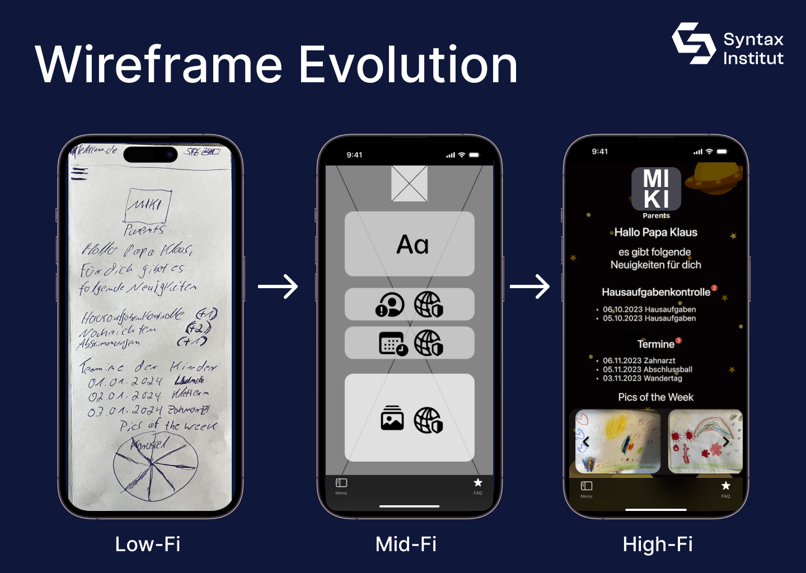

# MIKI Parents iOS

## Beschreibung

MIKI Parents iOS

MIKI Parents iOS wurde für verantwortungsbewusstes Parenting entwickelt.
 
Im Foku der App stehen Kinder gleichermaßen wie Eltern, Familienangehörige sowie optionale Kontrollorgane oder Behörden
 
MIKI Parents ist bereits für Android verfügbar.
 
Sämtliche Features innerhalb der App werden regelmäßig ergänzt bzw. neu hinzugefügt um ein umfassendes Nutzererlebnis zu ermöglichen.

## Installation

MIKI Parents ist aktuell als Xcode Swift Projektdatei via GitHub verfügbar.
 
MIKI Parents wird zukünftig als Testflight verfügbar sein.
 
MIKI Parents wird zukünftig im Apple App Store für iOS verfügbar sein.

## Nutzung

MIKI Parents soll bei Alltagsproblemen ein Bindeglied zwischen Vernatwortung, Bewusstsein & Kommunikation ermöglichen.
 
MIKI Parents kann nicht alle Probleme lösen.
MIKI Parents kann lösungsorientiert zur Seite stehen.
 
MIKI Parents hilft schon jetzt bei der Hausaufgbanekontrolle, Terminplanung und gibt eine bersicht der Lernfortschritte deiner Kinder.
Zukünftig wird MIKI Parents weitere Tools erhalten, um die Benutzerfreundlichkeit zu steigern.

## Projektaufbau

Die App ist nach dem MVVM-Muster (Model-View-ViewModel) strukturiert.
Dies sorgt für eine klare Trennung der Logik und Benutzeroberfläche und erleichtert Wartung und Erweiterungen. 

## Prozess

Konkurrenzanalyse
 
Personas
 
User Stories und Feature Requirements
 
User Flow Diagram
 
Crazy 8s
 
Low- Fi Wireframes
 
Paper Prototype
 
Moodboard
 
Style Guide
 
Mid-Fi Wireframes
 
High-Fi Wireframes
 
Prototype
 
Preference Test: Durchführung und Auswertung
 
Nutzertest und Anpassungen an den High-Fi Wireframes

## Tools

Frames
 
Crazy 8s
 
Mind Map
 
Konkurrenzanalyse
 
Nutzerinterviews mit einem Prototypen
 
Figma
 
Xcode
 
Google Firebase
 
Google Firestore
 
Ferienkalender API
 
Apple iTunes API
 
MVVM

## Design

## Lizenz
Aktuell ist keine Lizenz verfügbar.

## Kontakt

Entwickler: Daniel Gabler
 
E-Mail: daniel-gabler-dev@web.de
 
Internet: www.miki-apps.com

